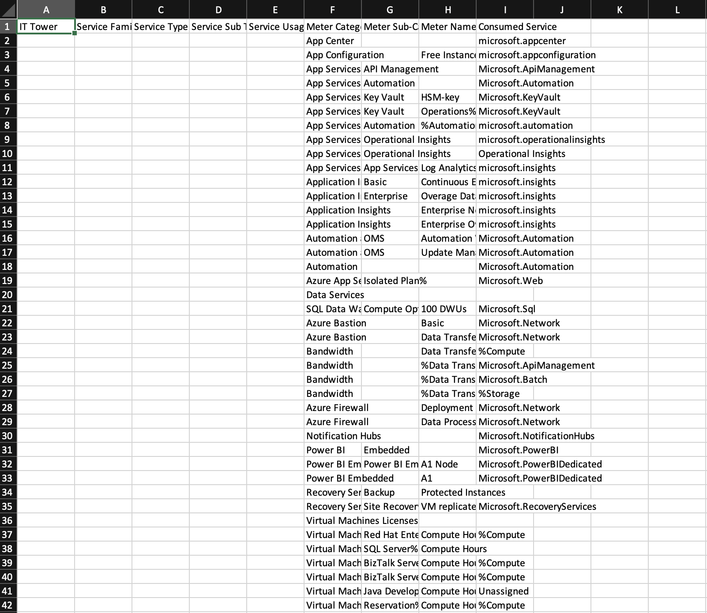
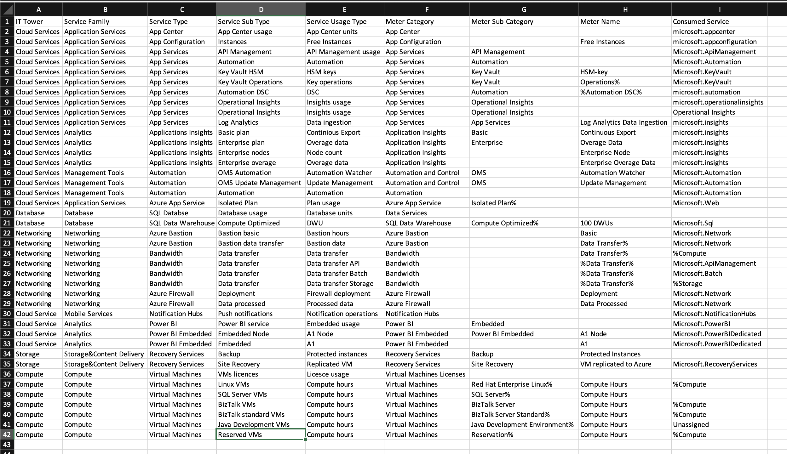

# Лабораторная работа 2. Вариант 6
Выполнил: Авдиенко Данила (464919). ОТиУ K24 МСТ 1.4

## Цель работы
Получение навыков аналитики и понимания спектра публичных облачных сервисов без привязки к вендору. Формирование у студентов комплексного видения Облака. 

## Дано:

1. Данные лабораторной работы 1.
2. Слепок данных биллинга от провайдера после небольшой обработки в виде SQL-параметров. Символ % в начале/конце означает, что перед/после него может стоять любой набор символов.
3. Образец итогового соответствия, что желательно получить в конце. В этом же документе  

## Необходимо:
1. Импортировать файл .csv в Excel или любую другую программу работы с таблицами. Для Excel делается на вкладке Данные – Из текстового / csv файла – выбрать файл, разделитель – точка с запятой.

2. Распределить потребление сервисов по иерархии, чтобы можно было провести анализ от большего к меньшему (напр. От всех вычислительных ресурсов Compute дойти до конкретного типа использования - Выделенной стойка в датацентре Dedicated host usage). При этом сохранять логическую концепцию, выработанную в Лабораторной работе 1.

3. Сохранить файл и залить в соответствующую папку на Google Drive.

## Теоретическая часть
**AWS (Amazon Web Services)** — облачная платформа от Amazon
Даёт всё подряд: виртуальные машины, базы данных, хранилища, очереди, аналитику, ИИ и т.д. Считается самым “старым” и крупным облаком, у него очень много разных сервисов и регионов.

**Microsoft Azure** — облачная платформа от Microsoft
По набору сервисов очень похожа на AWS: те же виртуалки, БД, хранилища, сети, аналитика и ИИ. Главный плюс — тесная интеграция с продуктами Microsoft: Windows Server, Active Directory, Office 365, SQL Server и т.п.

**Основные отличия для нас в лабе:**

- Набор базовых категорий (Compute, Storage, Database, Networking, Analytics и т.д.) одинаковый, меняются только названия сервисов.  
- В ЛР2 мы как раз строим единую модель, где AWS и Azure приводятся к одной и той же иерархии, чтобы не зависеть от конкретного вендора.

### Сервисная модель и иерархия
- **IT Tower** — большой раздел расходов: вычисления, хранилище, базы данных, сеть
- **Service Family** — подкатегория внутри тавера: аналитика, приложения, ИИ, безопасность 
- **Service Type** — конкретный облачный сервис: виртуальные машины, хранилища и тд
- **Service Sub Type** — какая именно операция внутри сервиса происходит
- **Service Usage Type** — по сути конкретезирует совершаемую операцию
  
В первой лабораторной эта модель применялась к сервисам AWS, во второй — к сервисам Microsoft Azure, но сама логика классификации остаётся той же.
  
### Облачные модели: IaaS, PaaS, SaaS
1. **IaaS** (Infrastructure as a service): провайдер предоставляет облачуню инфарструктуру (сервер, железо), где позльзователь сам настраивает использует их по своему назначению: ос, бд, вируталки
2. **Paas** (Platform as a Service): провайдет предоставляет готовую платформу для пользования юзером: для запуска кода, хранения бд и так далле
3. **Saas** (Software as a Service): провайдер дает готовое приложение, типа каких-нибудь веб сервисов. Пользователь просто пользуется функционалом, но за сам софт отвечает провайдер

## Ход выполнения работы
### Начальный вариант

На основе приложенного файла с примером заполнения таблицы, информации из интернета и https://docs.aws.amazon.com (документации) было профедено классифицирование. 

1. **Определение IT Tower, Service Family, Service Type** для каждого продукта из таблицы.
2. **Service Usage** заполнялся в соответсвие с Usage Type.

В итоге получилась такая табличка
