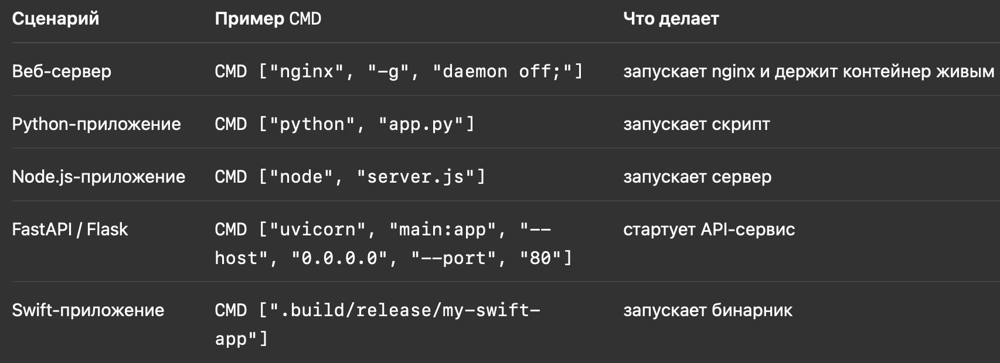

# 📘 Dockerfile. Что это?
#### с визуальным оформлением мне помог чат гпт :)


## 🧩 Виртуализация и контейнеризация

**Виртуализация** — это процесс, когда из хоста (твоя машина/сервер какой-то) берется часть ресурсов (процессор, оперативная память, постоянная память), чтобы создать **виртуальную машину**, работающую на этих ресурсах.  
Есть программы, которые контролируют виртуализацию и эти "временные" машины, например **VirtualBox**.

**Контейнеризация** — это процесс, когда мы хотим запустить какие-то процессы в изолированной среде (ну мы это же хотим и при виртуализации).  
Мы можем командно ограничивать доступ (изолировать) запускаемых процессов к сторонним файлам, но это тяжело, поэтому существует **Docker**, который отвечает за жизненный цикл такой изоляции для процессов.

---

## 🧱 Dockerfile

### 🔹 FROM nginx:1.19.1-alpine
Базовая настройка Dockerfile.  
Указанное после `FROM` — это **заготовка (образ/image)**, которую мы будем использовать как основу системы внутри контейнера.  
Такие образы содержат **минимальные нужные файлы для системы**: файловые системы, стандартные пути и прочие настройки, которые можно было бы прописать вручную, но есть готовые шаблоны.

Эти образы нам нужны, чтобы загруженные в контейнер файлы могли там работать, друг друга находить и так далее.

> 💡 Простая аналогия:
> - **Файлы** = твой фильм на флешке.  
> - **Образ (nginx:alpine)** = проигрыватель + розетка.  
> - **Контейнер** = включённый телевизор с твоим фильмом.

---

### 🔹 WORKDIR name
Создает **"главную" папку** внутри контейнера, где будут храниться все файлы проекта.  
Все команды (`COPY`, `RUN`) будут выполняться **относительно этой директории**.  
Внутри неё можно создавать дополнительные папки командой `RUN mkdir name`.  
Эти директории будут созданы **только внутри контейнера** и не появятся в локальном окружении.

---

### 🔹 RUN command
Выполняет команду **в среде контейнера во время сборки образа** (не при запуске, а при `docker build`).  
Примеры: установка пакетов, сборка проекта, подготовительные задачи.

> ✅ *Good practice*: объединять связанные команды в один `RUN`, чтобы уменьшить количество слоёв.

---

### 🔹 COPY loacalname containerPathName
Копирует что-то с локальной машины внутрь контейнера.  
Например:
```bash
COPY . /app
```
— скопирует всё из текущей директории в `/app`.  
или  
```bash
COPY src /app/src
```
— скопирует `src` локальный в `src` контейнера.

Иногда создают файл **`.dockerignore`** (аналог `.gitignore`), чтобы не копировать лишние файлы.  
Есть также команда `ADD`, которая умеет распаковывать архивы или качать файлы по URL, но используется реже.

---

### 🔹 CMD
Команда, которая **запускается после сборки** (после `docker build`) — то, что контейнер делает при старте.

Пример синтаксиса:
```bash
CMD ["python", "app.py"]
```
Эта команда говорит, что делать контейнеру после запуска.  
Если `CMD` не указать — контейнер сразу завершит работу.

---

### 🔹 Сценарии


---

### 🔹 EXPOSE
Команда, которая **документирует порты**, которые слушает контейнер.

**Порт** — это имя (номер), по которому из сети обращаются к нашему контенту внутри контейнера.  
Задавая порт, мы говорим, как извне обращаться к приложению.

Пример:
```
EXPOSE 800
```
и обращение к серверу:
```
ipAddressServer:800
```

Всё, что придёт на порт 800, при существующей команде `EXPOSE 800`, Docker будет направлять внутрь контейнера.  
Контент (наше приложение) должно иметь **код**, который сообщает Docker, что информация, пришедшая по этому порту, идёт в конкретное приложение.

> ❗️Два приложения не могут слушать один и тот же порт одновременно.

---

### 🔹 ENV
Задаёт **переменные окружения**, например:
```
ENV PORT=800
```
Используется для конфигов, токенов и других параметров.

---

### 🔹 ARG
То же самое, что `ENV`, но **существует только во время сборки**.  
Обычно используется для указания версии чего-либо.

---

### 🔹 VOLUME
**Том** — постоянное хранилище данных.  
Все данные, записанные через `VOLUME`, сохранятся даже после удаления контейнера.  
Файлы сохраняются в специальном Docker-томе.

Пример:
```
VOLUME /app/data
```
Весь контент из `/app/data` сохранится локально.

---

### 🔹 USER user_name
По умолчанию контейнеры работают под `root` (суперпользователь).  
Если в приложении появится уязвимость — злоумышленник сможет через контейнер получить root-доступ и потенциально повлиять на хост-систему.

Чтобы этого избежать, в продакшене root почти всегда **запрещён**.  
Новым пользователям нужно выдавать права **только на нужные директории**.

> ⚙️ Порты 1–1024 доступны только для root-пользователя.  
> Чтобы обычный пользователь слушал 443, нужны дополнительные настройки.

Во многих базовых образах уже прописан ограниченный системный пользователь,  
но **всегда лучше явно указать USER** и проверить, какой пользователь используется.

---
