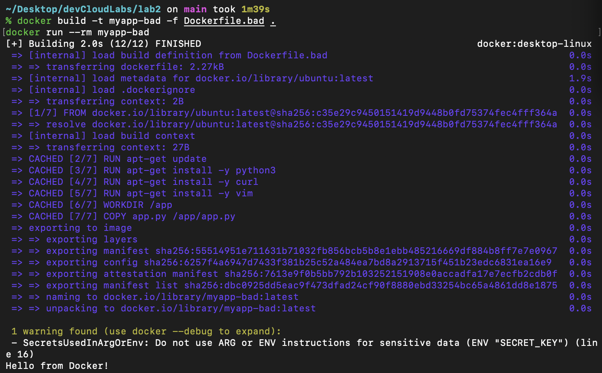
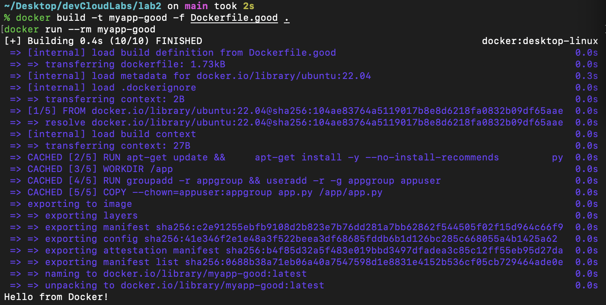

# Лабораторная работа №2 — Dockerfile (исправление bad practices)
#### с визуальным оформлением мне помог чат гпт :)

## 1. Ход работы

### 1.1 Создание исходного (неправильного) Dockerfile

Был создан Dockerfile с намеренно допущенными ошибками, отражающими плохие практики при работе с Docker.

Основные bad practices:
- использование `FROM ubuntu:latest` вместо конкретной версии образа;
- большое количество отдельных `RUN` команд, создающих лишние слои;
- хранение секретов внутри Dockerfile через `ENV`;
- работа под пользователем root;

Пример исходного файла:

---

### 1.2 Исправление ошибок

Был создан исправленный Dockerfile с учётом хороших практик (good practices).

Основные исправления:
- указана конкретная версия образа (`ubuntu:22.04`);
- команды установки объединены в один `RUN` с очисткой кеша (`rm -rf /var/lib/apt/lists/*`);
- добавлен пользователь `appuser` и группа `appgroup` для отказа от root;
- убрано хранение секретов в Dockerfile;

## 2. Объяснение исправлений

| Проблема | Было | Стало | Результат |
|-----------|------|--------|-----------|
| Использование `latest` | `FROM ubuntu:latest` | `FROM ubuntu:22.04` | Сборка стала стабильной и воспроизводимой |
| Несколько RUN | Несколько отдельных команд | Объединено в один RUN | Меньше слоёв, быстрее сборка |
| Хранение секретов | `ENV SECRET_KEY=...` | Удалено, передача через `-e` при запуске | Безопасность |
| Пользователь root | Не менялся | Добавлен `appuser`, `USER appuser` | Безопасность |
| Очистка кэша | Отсутствует | `rm -rf /var/lib/apt/lists/*` | Меньший размер образа |
| CMD | Shell-форма | Exec-форма | Корректная обработка сигналов |

## 3. Запуск контейнеров
### BAD

### GOOD

## 4. Результаты работы

В ходе выполнения лабораторной работы был создан Dockerfile с ошибками и исправленный вариант.  
Были изучены основные инструкции Dockerfile (`FROM`, `RUN`, `COPY`, `CMD`, `WORKDIR`, `USER`, `ENV`, `ARG`, `VOLUME`).  
Также подготовлен теоретический файл `lab2-theory.md`, в котором подробно описаны все команды и принципы работы.

## 5. Вывод

В результате работы я разобрался в структуре Dockerfile, назначении его инструкций и типичных ошибках при сборке контейнеров, описал их в виде построчных комментариев в самом коде. Создан исправленный Dockerfile, в котором исправлены ошибки.